# Sur la structure exacte diamant   $\mathcal{E}_\diamond$

Sunny Roy

  Département de mathématiques, Université de Sherbrooke

  Soutenance de thèse — Université de Sherbrooke 
  19 mai 2026

---

# Plan

<v-clicks>

1. **Motivation** &nbsp;: Modules presque rigides maximaux et retrouvabilité canonique de Jordan

2. **La structure exacte diamant** $\mathcal{E}_\diamond$

3. **Modules presque rigides et modules inclinants relatifs** &nbsp;\[Brüstle–Hanson–R.–Schiffler, 2024\]

4. **L'opérateur $\mathrm{GS}_\mathcal{E}$ et ses propriétés** &nbsp;*(Premier théorème principal)* &nbsp;\[Dequêne–R., 2025\]

5. **Mutations relatives et équivalence de module inclinant** &nbsp;*(Deuxième théorème principal)* &nbsp;\[Dequêne–R., 2025\]

6. **Nouveaux résultats** &nbsp;\[R., 2026\]

</v-clicks>

---

# Cadre

<v-clicks>

- $K$ est un corps algébriquement clos.

- $Q$ est un **carquois de Dynkin** sans relations.

- $\operatorname{rep}(Q)$ désigne la catégorie des $KQ$-modules à gauche de dimension finie.

- $\mathscr{A}$ désignera une **catégorie abélienne héréditaire avec suffisamment de projectifs**.

- Toutes les sous-catégories sont supposées **pleines**, closes par sommes directes finies et par facteurs directs.

</v-clicks>

---
layout: section
class: text-center
---

# I. Motivation

Modules presque rigides maximaux et retrouvabilité canonique de Jordan

---

# Modules presque rigides maximaux

Pour $Q$ de type $\mathbb{A}_n$, les représentations indécomposables de $\operatorname{rep}(Q)$ admettent une **réalisation géométrique** : chaque indécomposable correspond à une *diagonale orientée* ou une *arête orientée* d'un $(n+1)$-gone.

<v-clicks>

::div{class="callout-question mt-4"}
**Observation clé** &nbsp;— Sous cette réalisation, les *triangulations* du $(n+1)$-gone font naturellement ressortir une classe distinguée de modules.
::

<strong>Barnard–Gunawan–Meehan–Schiffler</strong> &#91;BGMS21&#93; ont introduit et étudié celles-ci comme représentations <em>presque rigides maximales (MAR)</em>.

</v-clicks>

---

# Modules presque rigides maximaux

::div{class="definition mt-2"}
**Définition** &nbsp;&#91;BGMS21&#93; &nbsp;Un module basique $M \in \operatorname{rep}(\mathbb{A}_n)$ est *presque rigide* si pour tout couple de facteurs directs indécomposables $X$, $Y$ de $M$, soit $\operatorname{Ext}^1(X, Y) = 0$, soit $\operatorname{Ext}^1(X, Y) \cong K$ est engendré par une suite exacte courte $0 \to Y \to E \to X \to 0$ avec $E$ indécomposable.
::

<v-clicks>

::div{class="definition mt-3"}
Il est *presque rigide maximal (MAR)* s'il est presque rigide et que l'ajout de tout facteur direct non nul brise la presque rigidité.
::

::div{class="theorem mt-4"}
**Théorème** &nbsp;&#91;BGMS21&#93; &nbsp;Pour $Q$ de type $\mathbb{A}_{n+2}$, il existe une bijection
$$\{\text{triangulations de } P(Q)\} \xrightarrow{\;\sim\;} \mathrm{mar}(Q).$$
En particulier, toute représentation MAR possède exactement $2n+3$ facteurs directs et $|\mathrm{mar}(Q)|$ est égal au nombre de Catalan $\dfrac{1}{n+2}\dbinom{2n+2}{n+1}$.
::

</v-clicks>

---

# Invariant de forme de Jordan

En théorie des représentations, on cherche souvent des <strong>invariants</strong> qui classifient les objets à isomorphisme près.

<v-clicks>

La <strong>forme de Jordan</strong> est l'un des invariants les plus simples et les plus classiques attachés aux endomorphismes. Elle encode des informations structurelles essentielles.

  <strong>Question</strong> &nbsp;— Peut-on retrouver une représentation à partir des formes de Jordan de ses endomorphismes nilpotents ?

Dans des travaux récents, <strong>Garver–Patrias–Thomas</strong> (2018–2022) ont introduit et développé les notions de <em>retrouvabilité de Jordan (JR)</em> et de <em>retrouvabilité canonique de Jordan (CJR)</em>. Ces idées ont ensuite été approfondies par <strong>Dequêne</strong> (2022–2024).

</v-clicks>

---

# Forme de Jordan pour les représentations

Soit $E = (E_q, E_\alpha) \in \operatorname{rep}(Q)$ et $N = (N_q)_{q \in Q_0} \in \operatorname{NEnd}(E)$. Chaque $N_q$ est un endomorphisme nilpotent de $E_q$.

**Définition**

La **forme de Jordan** de $N_q$ est la partition $\operatorname{JF}(N_q) \vdash \dim(E_q)$ enregistrant les tailles de ses blocs de Jordan. On définit le tuple

$$\operatorname{JF}(N) = \bigl(\operatorname{JF}(N_q)\bigr)_{q \in Q_0},$$

qui décrit la structure en blocs de $N$ à chaque sommet.

---

# L'invariant de forme de Jordan générique

Fixons $E \in \operatorname{rep}(Q)$. Pour $N = (N_q)_{q \in Q_0} \in \operatorname{NEnd}(E)$, on pose $\operatorname{JF}(N) = (\operatorname{JF}(N_q))_{q \in Q_0}$.

**Définition \[GPT23\]**

La **forme de Jordan générique** de $E$ est la valeur maximale par rapport à l'ordre de dominance :

$$\operatorname{GenJF}(E) \;=\; \max_{N \,\in\, \operatorname{NEnd}(E)} \operatorname{JF}(N).$$

**Question** &nbsp;— Cet invariant est-il complet ?

---

# Retrouvabilité de Jordan

**Définition \[GPT23\]**

Soit $\mathscr{C} \subseteq \operatorname{rep}(Q)$ une sous-catégorie pleine. On dit que $\mathscr{C}$ est **retrouvable de Jordan (JR)** si

$$E \simeq F \;\iff\; \operatorname{GenJF}(E) = \operatorname{GenJF}(F) \qquad \text{pour tout } E, F \in \mathscr{C}.$$

**Remarque**

La forme de Jordan générique $\operatorname{GenJF}$ est un **invariant complet** sur $\mathscr{C}$.

---

# Retrouvabilité canonique de Jordan (CJR)

**Définition \[GPT23\]**

Soit $\mathscr{C} \subseteq \operatorname{rep}(Q)$. On dit que $\mathscr{C}$ est **canoniquement retrouvable de Jordan (CJR)** si pour tout $X \in \mathscr{C}$ il existe un ouvert dense (Zariski) $\Omega \subseteq \operatorname{rep}_K\bigl(\operatorname{GenJF}(X)\bigr)$ tel que pour tout $Y \in \Omega$, $Y \simeq X$.

**Sous-catégorie CJR maximale**

Une sous-catégorie CJR $\mathscr{C}$ est **maximale** si elle n'est pas proprement contenue dans une plus grande sous-catégorie CJR de $\operatorname{rep}(Q)$ :

$$\forall\, \mathscr{D} \supsetneq \mathscr{C}, \quad \mathscr{D} \text{ n'est pas CJR.}$$

---
layout: two-cols
---

# Exemple sur $A_2$ : JR mais pas CJR

Supposons $Q : 1 \to 2$ et posons $\mathscr{C} = \operatorname{add}(S_1, S_2)$.

<v-clicks>

Tout $E \in \mathscr{C}$ est de la forme $\;E = K^a \xrightarrow{\;0\;} K^b$.

**Forme de Jordan générique :** $\;\operatorname{GenJF}(E) = \bigl((a),\,(b)\bigr).$

Donc $\mathscr{C}$ est **JR**.

</v-clicks>

::right::

**Mais $\mathscr{C}$ n'est pas CJR.**

Considérons $S_1 \oplus S_2 \cong K \xrightarrow{0} K$. Tout ouvert dense $U \subseteq \operatorname{rep}_K(Q,\,(1,1))$ contient $P_1 = K \xrightarrow{\lambda} K$ avec $\lambda \neq 0$.

$$\operatorname{GenJF}(S_1 \oplus S_2) = \bigl((1),(1)\bigr) = \operatorname{GenJF}(P_1)$$

mais $S_1 \oplus S_2 \not\simeq P_1$.

---

# Sous-catégories CJR maximales de type $A_n$

Soit $Q$ un carquois de type $A_n$.

**Proposition**

Si $\mathscr{C} \subseteq \operatorname{rep}(Q)$ est une sous-catégorie canoniquement retrouvable de Jordan maximale, alors :

<v-clicks>

<em>(a)</em> $\mathscr{C}$ est close par extensions ;

<em>(b)</em> $\mathscr{C}$ contient toujours une représentation inclinante.

</v-clicks>

**Théorème \[Deq23a\]**

Une sous-catégorie $\mathscr{C} \subseteq \operatorname{rep}(Q)$ est canoniquement retrouvable de Jordan si et seulement si toute suite exacte courte non scindée

$$0 \longrightarrow X \longrightarrow Y \longrightarrow Z \longrightarrow 0$$

avec $X, Z \in \mathscr{C}$ vérifie $Y \notin \operatorname{ind}\bigl(\operatorname{rep}(Q)\bigr)$.

---

# MAR et CJR maximale

::div{class="definition mt-2"}
**Définition** &nbsp;&#91;BGMS21&#93; &nbsp;Un module basique $M \in \operatorname{rep}(A_n)$ est *presque rigide* si pour tout couple de facteurs directs indécomposables $X$, $Y$ de $M$, soit $\operatorname{Ext}^1(X, Y) = 0$, soit $\operatorname{Ext}^1(X, Y) \cong K$ est engendré par une suite exacte courte $0 \to Y \to E \to X \to 0$ avec $E$ indécomposable. Il est *presque rigide maximal (MAR)* si l'ajout de tout facteur direct non nul brise la presque rigidité.
::

<v-clicks>

::div{class="theorem mt-4"}
**Théorème** &nbsp;&#91;Deq23a&#93; &nbsp;Une sous-catégorie $\mathscr{C} \subseteq \operatorname{rep}(A_n)$ est canoniquement retrouvable de Jordan si et seulement si toute suite exacte courte non scindée
$$0 \longrightarrow X \longrightarrow Y \longrightarrow Z \longrightarrow 0$$
avec $X, Z \in \mathscr{C}$ vérifie $Y \notin \operatorname{ind}\bigl(\operatorname{rep}(A_n)\bigr)$.
::

  <video :src="'/ediam_thinking.webm'" autoplay muted playsinline style="max-height:200px; border-radius:8px;" />

</v-clicks>

---
layout: section
class: text-center
---

# II. La structure exacte diamant

$\mathcal{E}_\diamond$

---

# Structures exactes

**Définition**

Une collection $\mathcal{E}$ de suites exactes courtes dans $\mathscr{A}$ est une **structure exacte** sur $\mathscr{A}$ lorsque $\mathcal{E}$ vérifie :

<v-clicks>

<strong>(ES1)</strong> &nbsp; Toutes les suites exactes courtes scindées sont dans $\mathcal{E}$.

<strong>(ES2)</strong> &nbsp; La collection des $\mathcal{E}$-monomorphismes et celle des $\mathcal{E}$-épimorphismes sont toutes deux closes par composition.

<strong>(ES3)</strong> &nbsp; $\mathcal{E}$ est close par sommes amalgamées et produits fibrés le long de tout morphisme.

</v-clicks>

  

    <AnimatedSVG :src="'/es3_pushout.svg'" viewBox="22 180 146 43" />
    <strong>(ES3-I)</strong> Sommes amalgamées

$\mathcal{E}$ est close par sommes amalgamées.

  

  

    <AnimatedSVG :src="'/es3_pullback.svg'" viewBox="191 178 146 43" />
    <strong>(ES3-II)</strong> Produits fibrés

$\mathcal{E}$ est close par produits fibrés.

  

---

# Catégories exactes

**Définition**

Soit $\mathcal{E}$ une structure exacte sur $\mathscr{A}$. La paire $(\mathscr{A},\,\mathcal{E})$ est appelée une **catégorie exacte**.

<strong>Exemples de structures exactes</strong>

<v-clicks>

$\mathcal{E}_{\max}$ &nbsp;— la <strong>structure exacte maximale</strong>, contenant toutes les suites exactes courtes.

$\mathcal{E}_{\min}$ &nbsp;— la <strong>structure exacte minimale</strong>, contenant uniquement les suites exactes courtes scindées.

</v-clicks>

---

# Suites exactes courtes de type $A_n$

**Théorème**

Soit $Q$ un carquois de type $A_n$. Pour une suite exacte non scindée

$$0 \longrightarrow D \longrightarrow E \longrightarrow F \longrightarrow 0, \qquad D, F \in \operatorname{ind}(\operatorname{rep}(Q)),$$

exactement l'un des cas suivants se produit :

<v-clicks>

<em>(a)</em> $E \in \operatorname{ind}(\operatorname{rep}(Q))$,

<em>(b)</em> $E \cong E_1 \oplus E_2$ avec $E_1, E_2 \in \operatorname{ind}(\operatorname{rep}(Q))$.

Dans le cas (b), on l'appelle une <strong>suite exacte diamant</strong>.

</v-clicks>

---

# La structure exacte diamant $\mathcal{E}_\diamond$

**Définition**

Soit $Q$ un carquois de type $A_n$. On définit la collection de suites exactes courtes $\mathcal{E}_{\diamond}$ donnée par le bifoncteur additif $\mathcal{E}_\diamond(-,-)$, uniquement déterminé par

$$\mathcal{E}_\diamond(N,M) = \bigl\{\, \eta \in \operatorname{Ext}^1(N,M) \;\big|\; \eta \text{ est scindée ou une suite exacte diamant}\,\bigr\}$$

pour $M, N \in \operatorname{ind}(\operatorname{rep}(Q))$ indécomposables.

**Proposition \[Brüstle–Hanson–R.–Schiffler, 2024\]**

Soit $n \in \mathbb{N}^*$ et $Q$ un carquois de type $A_n$. Alors $\mathcal{E}_{\diamond}$ est une structure exacte sur $\mathscr{A} = \operatorname{rep}(Q)$.

---
layout: section
class: text-center
---

# III. Modules presque rigides et modules inclinants relatifs

---

# Modules MAR via $\mathcal{E}_\diamond$

::div{class="definition mt-2"}
**Rappel** &nbsp;Un module basique $M \in \operatorname{rep}(A_n)$ est *presque rigide* si pour tout couple de facteurs directs indécomposables $X$, $Y$ de $M$, soit $\operatorname{Ext}^1(X, Y) = 0$, soit $\operatorname{Ext}^1(X, Y) \cong K$ est engendré par une suite exacte courte $0 \to Y \to E \to X \to 0$ avec $E$ indécomposable.
::

<v-clicks>

::div{class="definition mt-8"}
**Définition** &nbsp;&#91;BHRS24&#93; &nbsp;Un module basique $M \in \operatorname{rep}(A_n)$ est *presque rigide* s'il est $\mathcal{E}_\diamond$-rigide, c'est-à-dire $\mathcal{E}_\diamond(M, M) = 0$.
::

::div{class="remark mt-3"}
**Remarque** &nbsp;$M$ est *presque rigide maximal (MAR)* s'il est $\mathcal{E}_\diamond$-rigide et que l'ajout de tout facteur direct non nul brise la $\mathcal{E}_\diamond$-rigidité.
::

::div{class="callout-question mt-6"}
**Question** &nbsp;— Cette reformulation relative est-elle utile pour décrire les modules MAR ?
::

</v-clicks>

---

# Module inclinant classique et relatif

Soit $\mathscr{A}$ une catégorie abélienne avec suffisamment de projectifs.

<v-clicks>

::div{class="definition mt-4"}
**Définition** &nbsp;Un objet basique $T \in \mathscr{A}$ est *inclinant* si :

1. $\operatorname{pd}(T) \leq 1$

2. $T$ est rigide, c'est-à-dire $\operatorname{Ext}^1(T, T) = 0$

3. Pour tout $P \in \operatorname{proj}(\mathscr{A})$, il existe une suite exacte courte $0 \to P \to T_0 \to T_1 \to 0$ avec $T_0, T_1 \in \operatorname{add}(T)$.
::

::div{class="mt-6"}
Soit $(\mathscr{A}, \textcolor{#63b3ed}{\mathcal{E}})$ une catégorie exacte avec suffisamment de projectifs.
::

::div{class="definition mt-4"}
**Définition** &nbsp;Un objet basique $T \in \mathscr{A}$ est *$\mathcal{E}$-inclinant* si :

1. $\operatorname{pd}_{\textcolor{#63b3ed}{\mathcal{E}}}(T) \leq 1$

2. $T$ est $\textcolor{#63b3ed}{\mathcal{E}}$-rigide, c'est-à-dire $\textcolor{#63b3ed}{\mathcal{E}}(T, T) = 0$

3. Pour tout $P \in \operatorname{proj}_{\textcolor{#63b3ed}{\mathcal{E}}}(\mathscr{A})$, il existe une suite exacte courte $0 \to P \to T_0 \to T_1 \to 0\, \textcolor{#63b3ed}{\in \mathcal{E}}$ avec $T_0, T_1 \in \operatorname{add}(T)$.
::

</v-clicks>

---

# Exemple : $Q = 1 \to 2 \to 3 \leftarrow 4$

  <iframe src="https://ar-quiver-simulator.vercel.app" style="width:154%; height:154%; border:none; transform:scale(0.65); transform-origin:top left;" />

---

# Catégories 0-Auslander

Soit $(\operatorname{rep}(Q), \mathcal{E})$ une catégorie exacte avec suffisamment de projectifs.

::div{class="definition mt-4"}
**Définition** &nbsp;&#91;GNP23&#93; &nbsp;$(\operatorname{rep}(Q), \mathcal{E})$ est une **catégorie 0-Auslander** si :

1. $\mathcal{E}\text{-gl.dim}(\operatorname{rep}(Q)) \leq 1$

2. Pour tout $P \in \operatorname{proj}_\mathcal{E}(\operatorname{rep}(Q))$, il existe une suite exacte courte $0 \to P \to Q \to I \to 0 \in \mathcal{E}$ avec $Q \in \operatorname{proj}_\mathcal{E}(\operatorname{rep}(Q)) \cap \operatorname{inj}_\mathcal{E}(\operatorname{rep}(Q))$ et $I \in \operatorname{inj}_\mathcal{E}(\operatorname{rep}(Q))$. C'est-à-dire que la $\mathcal{E}$-dimension dominante de $\operatorname{rep}(Q)$ est au moins $1$.

::

::div{class="theorem mt-5"}
**Théorème** &nbsp;&#91;GNP23&#93; &nbsp;Supposons que $(\operatorname{rep}(Q), \mathcal{E})$ est 0-Auslander. Les énoncés suivants sont équivalents pour $T \in \operatorname{rep}(Q)$ :

1. $T$ est $\mathcal{E}$-inclinant.

2. $T$ est maximal $\mathcal{E}$-rigide.
::

::div{class="remark mt-4"}
**Remarque** &nbsp;Le nombre de facteurs directs indécomposables de $T$ est égal au nombre de $P \in \operatorname{proj}_\mathcal{E}(\operatorname{rep}(Q))$ indécomposables non isomorphes.
::

---

# MAR et module inclinant relatif

::div{class="proposition mt-4"}
**Proposition** &nbsp;&#91;BHRS24&#93; &nbsp;$(\operatorname{rep}(A_n), \mathcal{E}_\diamond)$ est une catégorie 0-Auslander.
::

<v-clicks>

::div{class="definition mt-4"}
**Rappel** &nbsp;Un module basique $M \in \operatorname{rep}(A_n)$ est *presque rigide* s'il est $\mathcal{E}_\diamond$-rigide, c'est-à-dire $\mathcal{E}_\diamond(M, M) = 0$. Il est *presque rigide maximal (MAR)* s'il est maximal $\mathcal{E}_\diamond$-rigide.
::

::div{class="theorem mt-10"}
**Théorème** &nbsp;&#91;BHRS24&#93; &nbsp;Un module basique $M \in \operatorname{rep}(A_n)$ est MAR si et seulement s'il est $\mathcal{E}_\diamond$-inclinant.
::

</v-clicks>

---
layout: section
class: text-center
---

# IV. L'opérateur $\mathrm{GS}_\mathcal{E}$ et ses propriétés

Premier théorème principal

---

# CJR via $\mathcal{E}_\diamond$

<v-clicks>

::div{class="theorem mt-2"}
**Rappel** &nbsp;&#91;Deq23a&#93; &nbsp;Une sous-catégorie $\mathscr{C} \subseteq \operatorname{rep}(A_n)$ est canoniquement retrouvable de Jordan si et seulement si toute suite exacte courte non scindée $0 \to X \to Y \to Z \to 0$ avec $X, Z \in \mathscr{C}$ vérifie $Y \notin \operatorname{ind}(\operatorname{rep}(A_n))$.
::

::div{class="definition mt-5"}
**Définition** &nbsp;Soit $(\mathscr{A}, \mathcal{E})$ une catégorie exacte.

Une sous-catégorie $\mathscr{C} \subseteq \mathscr{A}$ est **$\mathcal{E}$-adaptée** si pour tout $X, Y \in \mathscr{C}$, $\operatorname{Ext}^1(X, Y) \subseteq \mathcal{E}$.
::

::div{class="theorem mt-5"}
**Théorème** &nbsp;&#91;BR25&#93; &nbsp;Une sous-catégorie $\mathscr{C} \subseteq \operatorname{rep}(A_n)$ est canoniquement retrouvable de Jordan si et seulement si $\mathscr{C}$ est $\mathcal{E}_\diamond$-adaptée.
::

::div{class="remark mt-4"}
**Remarque** &nbsp;$\mathscr{C}$ est maximalement canoniquement retrouvable de Jordan si et seulement si toute sous-catégorie $\mathscr{D} \supset \mathscr{C}$ n'est pas $\mathcal{E}_\diamond$-adaptée.
::

</v-clicks>

---
clicks: 16
---

# L'intuition principale

::div{class="theorem mt-4"}
**Rappel** &nbsp;Supposons que $\mathscr{C} \subseteq \operatorname{rep}(A_n)$ est une sous-catégorie CJR maximale. Alors :

a) $\mathscr{C}$ est maximalement $\mathcal{E}_\diamond$-adaptée.

b) $\mathscr{C}$ est close par extensions.

c) $\mathscr{C}$ contient un module inclinant $T$.

::

  <FloatingBalls :visible="Math.max(0, $clicks - 3)" :seq-visible="Math.max(0, $clicks - 8)" :sec-visible="Math.max(0, $clicks - 13)" :highlight="$clicks >= 16" />

::div{v-click="8" style="position:absolute; bottom:2rem; left:calc(8rem - 30px); font-style:italic; font-size:1rem; color:#fc8181; display:flex; align-items:center; height:34px;"}
$T_i \in \operatorname{add}(T)$
::

::div{style="position:absolute; bottom:2rem; left:calc(18rem - 30px); display:flex; align-items:center; height:34px; gap:6px; font-size:0.9rem;"}
= 13 ? 1 : 0, transition: 'opacity 0.6s ease' }">$0 \to$ <SeqCircles /> $\to 0$= 15 ? 0 : ($clicks >= 13 ? 1 : 0), transition: $clicks >= 15 ? 'none' : 'opacity 0.6s ease', pointerEvents: 'none', width: $clicks >= 15 ? '0' : 'auto', overflow: 'hidden', display: 'inline-block' }">$\ \in \mathcal{E}_\diamond$= 15 ? 1 : 0, transition: 'opacity 0.6s ease 0.05s', marginLeft: '-6px' }">$,\quad 0 \to$ <SeqCircles left="K'₂" mid="C₂" right="C'₂" left-color="#63b3ed" mid-color="#68d391" right-color="#63b3ed" /> $\to 0\,,\quad 0 \to$ <SeqCircles left="K'₄" mid="K₄" right="C'₄" left-color="#63b3ed" mid-color="#68d391" right-color="#63b3ed" /> $\to 0\ \in \mathcal{E}_\diamond$
::

---

# Les opérateurs $\operatorname{Gen}_\mathcal{E}$ et $\operatorname{Sub}_\mathcal{E}$

Soit $(\mathscr{A}, \mathcal{E})$ une catégorie exacte.

**Définition**

Pour une sous-catégorie $\mathscr{C} \subseteq \mathscr{A}$, on définit :

<v-clicks>

<em>(a)</em> &nbsp; $\operatorname{Gen}_{\mathcal{E}}(\mathscr{C}) = \{ C \in \mathscr{A} \mid \exists\, g : Y \twoheadrightarrow C,\; Y \in \mathscr{C},\; g\ \mathcal{E}\text{-épi} \}$

<em>(b)</em> &nbsp; $\operatorname{Sub}_{\mathcal{E}}(\mathscr{C}) = \{ K \in \mathscr{A} \mid \exists\, f : K \rightarrowtail Y,\; Y \in \mathscr{C},\; f\ \mathcal{E}\text{-mono} \}$

</v-clicks>

Pour un objet $M \in \mathscr{A}$, on pose $\operatorname{Gen}_\mathcal{E}(M) = \operatorname{Gen}_\mathcal{E}(\operatorname{add}(M))$ et $\operatorname{Sub}_\mathcal{E}(M) = \operatorname{Sub}_\mathcal{E}(\operatorname{add}(M))$.

---

# La construction $\operatorname{GS}_\mathcal{E}$

**Définition**

Soit $\mathscr{C} \subseteq \mathscr{A}$ une sous-catégorie.

<v-clicks>

<em>(a)</em> &nbsp; On pose $\operatorname{GS}_{\mathcal{E}}^0(\mathscr{C}) = \mathscr{C}$.

<em>(b)</em> &nbsp; Pour $i \geq 1$, on définit

$$\operatorname{GS}_\mathcal{E}^i(\mathscr{C}) = \operatorname{add}\!\Bigl(\operatorname{Gen}_\mathcal{E}(\operatorname{GS}_\mathcal{E}^{i-1}(\mathscr{C})),\; \operatorname{Sub}_\mathcal{E}(\operatorname{GS}_\mathcal{E}^{i-1}(\mathscr{C}))\Bigr).$$

</v-clicks>

<strong>Remarque.</strong> $(\operatorname{GS}_\mathcal{E}^i(\mathscr{C}))_{i \in \mathbb{N}}$ est une suite croissante de sous-catégories de $\mathscr{A}$.

---

# L'opérateur $\operatorname{GS}_\mathcal{E}$

**Définition**

L'opérateur $\operatorname{GS}_\mathcal{E}$ est défini par

$$\operatorname{GS}_\mathcal{E}(\mathscr{C}) = \varinjlim_{i \in \mathbb{N}} \operatorname{GS}_\mathcal{E}^i(\mathscr{C}) = \bigcup_{i \in \mathbb{N}} \operatorname{GS}_\mathcal{E}^i(\mathscr{C}).$$

De manière équivalente, $\operatorname{GS}_\mathcal{E}(\mathscr{C})$ est la <strong>plus petite sous-catégorie</strong> de $\mathscr{A}$ contenant $\mathscr{C}$ et close par $\operatorname{Gen}_\mathcal{E}$ et $\operatorname{Sub}_\mathcal{E}$.

Pour un objet $M \in \mathscr{A}$, on pose $\operatorname{GS}_\mathcal{E}(M) = \operatorname{GS}_\mathcal{E}(\operatorname{add}(M))$.

---

# Exemple : $\operatorname{GS}_{\mathcal{E}_\diamond}$ sur $A_7$

  <PausableVideo src="/poset_full_anim.webm" :pausePoints="[2.5, 6.7, 13.1, 17.3, 23.8, 28.0, 34.5, 38.7, 45.2, 49.4, 55.9, 60.1, 66.6, 70.8, 77.3, 81.5, 88.0]" :playbackRate="1.5" />

<GsFormulas :step="Math.max(0, $clicks - 17)" style="position:absolute; top:38%; right:2rem;" />

---

# Propriétés de $\operatorname{GS}_\mathcal{E}$

**Proposition**

Soit $\mathscr{C} \subseteq \mathscr{A}$ une sous-catégorie.

<v-clicks>

1. Si $\mathscr{C}$ est $\mathcal{E}$-adaptée, alors $\operatorname{GS}_\mathcal{E}(\mathscr{C})$ est aussi $\mathcal{E}$-adaptée.

2. Si $\mathscr{C}$ est $\mathcal{E}$-adaptée et close par extensions, alors $\operatorname{GS}_\mathcal{E}(\mathscr{C})$ est aussi close par extensions.

</v-clicks>

<v-clicks>

<strong>Corollaire 1.</strong> Soit $T \in \mathscr{A}$ un objet inclinant. Alors $\operatorname{GS}_\mathcal{E}(T)$ est $\mathcal{E}$-adapté et clos par extensions.

<strong>Corollaire 2.</strong> Soit $T \in \operatorname{rep}(A_n)$ un objet inclinant. Alors $\operatorname{GS}_{\mathcal{E}_\diamond}(T)$ est canoniquement retrouvable de Jordan.

<strong>Question :</strong> $\operatorname{GS}_{\mathcal{E}_\diamond}(T)$ est-il maximalement canoniquement retrouvable de Jordan ?

</v-clicks>

---

# Premier théorème principal

**Théorème \[DR25\]**

Soit $T \in \mathscr{A}$ un objet inclinant. Alors $\operatorname{GS}_\mathcal{E}(T)$ est une sous-catégorie **maximalement** $\mathcal{E}$-adaptée, close par extensions, de $\mathscr{A}$ contenant $T$.

*En particulier, toute sous-catégorie maximalement canoniquement retrouvable de Jordan est de la forme $\operatorname{GS}_{\mathcal{E}_\diamond}(T)$ pour un certain objet inclinant $T$.*

**Corollaire**

Pour tout objet inclinant $T \in \mathscr{A}$,

$$\operatorname{GS}_{\mathcal{E}}(T) \;=\; \operatorname{GS}_{\mathcal{E}}^2(T).$$

Comment décrire la relation d'équivalence $\;T \sim_\mathcal{E} T' \iff \operatorname{GS}_{\mathcal{E}}(T) = \operatorname{GS}_{\mathcal{E}}(T')$ ?

---
layout: section
class: text-center
---

# V. Mutations relatives et équivalence de module inclinant

Deuxième théorème principal

---

# Mutation classique = 2 ? 1 : 0, transition:'opacity 0.4s' }">($\mathcal{E}$-mutation)

**Définition**

Soit $T = U \oplus \overline{T}$ un objet inclinant avec $U$ indécomposable.

Une = 2 ? '1em' : '0', opacity: $clicks >= 2 ? 1 : 0, transition:'font-size 0.3s, opacity 0.3s', color:'#60a5fa' }">$\mathcal{E}$-**mutation** de $T$ en $U$ est un objet inclinant $\mu_U(T) = U' \oplus \overline{T}$, où $U'$ est obtenu de $U$ par une = 2 ? '1em' : '0', opacity: $clicks >= 2 ? 1 : 0, transition:'font-size 0.3s, opacity 0.3s', color:'#60a5fa' }">$\mathcal{E}$-suite d'échange

$$\xi:\; 0 \rightarrow U \xrightarrow{f} B \xrightarrow{g} U' \rightarrow 0, \qquad B \in \operatorname{add}(\overline{T}),$$

= 2 ? 1 : 0, transition:'opacity 0.4s' }">

$$\xi:\; 0 \rightarrow U \xrightarrow{f} B \xrightarrow{g} U' \rightarrow 0\,\textcolor{#60a5fa}{\in \mathcal{E}}, \qquad B \in \operatorname{add}(\overline{T}),$$

où $f$ est une approximation minimale à gauche de $U$ par $\operatorname{add}(\overline{T})$, et $g$ est une approximation minimale à droite de $U'$ par $\operatorname{add}(\overline{T})$.

On note $\textcolor{#e2b96f}{\mu_U^+(T)}$ (resp. $\textcolor{#e2b96f}{\mu_U^-(T)}$) la mutation droite (resp. gauche).

= 2 ? 1 : 0, transition:'opacity 0.4s' }">

On note $\textcolor{#e2b96f}{\mu_{U,\textcolor{#60a5fa}{\mathcal{E}}}^+(T)}$ (resp. $\textcolor{#e2b96f}{\mu_{U,\textcolor{#60a5fa}{\mathcal{E}}}^-(T)}$) la $\mathcal{E}$-mutation droite (resp. gauche).

---

# Exemple : $Q = 1 \to 2 \leftarrow 3 \to 4$ avec $\mathcal{E} = \mathcal{E}_{\max}$

  <iframe src="https://ar-quiver-simulator.vercel.app" style="width:154%; height:154%; border:none; transform:scale(0.65); transform-origin:top left;" />

---

# $\mathcal{E}$-Atteignabilité

**Définition**

Soient $T, T' \in \operatorname{Tilt}(Q)$.

$T'$ est **$\mathcal{E}$-atteignable** depuis $T$ s'il existe des indécomposables $(U_1, \dots, U_m)$ tels que

$$T' \cong \mu_{U_m,\mathcal{E}} \circ \cdots \circ \mu_{U_1,\mathcal{E}}(T).$$

**La $\mathcal{E}$-atteignabilité** $T \approx_{\mathcal{E}} T'$ est une relation d'équivalence. On note $[T]_{\approx_\mathcal{E}}$ la classe d'équivalence de $T$.

---

# Exemple : $Q = 1 \to 2 \leftarrow 3 \to 4$ avec $\mathcal{E} = \mathcal{E}_\diamond$

  <iframe src="https://ar-quiver-simulator.vercel.app" style="width:154%; height:154%; border:none; transform:scale(0.65); transform-origin:top left;" />

---

# Équivalence de modules inclinants

**Question précédente** &nbsp;— Comment décrire $T \sim_\mathcal{E} T' \iff \operatorname{GS}_{\mathcal{E}}(T) = \operatorname{GS}_{\mathcal{E}}(T')$ ?

**Proposition**

Soient $T, T' \in \operatorname{Tilt}(Q)$. Alors

$$T \sim_{\mathcal{E}} T' \quad \Longleftrightarrow \quad T \approx_{\mathcal{E}} T'.$$

---

# Équivalence de modules inclinants

**Exemple.** Supposons $Q = 1 \to 2 \leftarrow 3 \to 4$ et $\mathcal{E} = \mathcal{E}_\diamond$.

  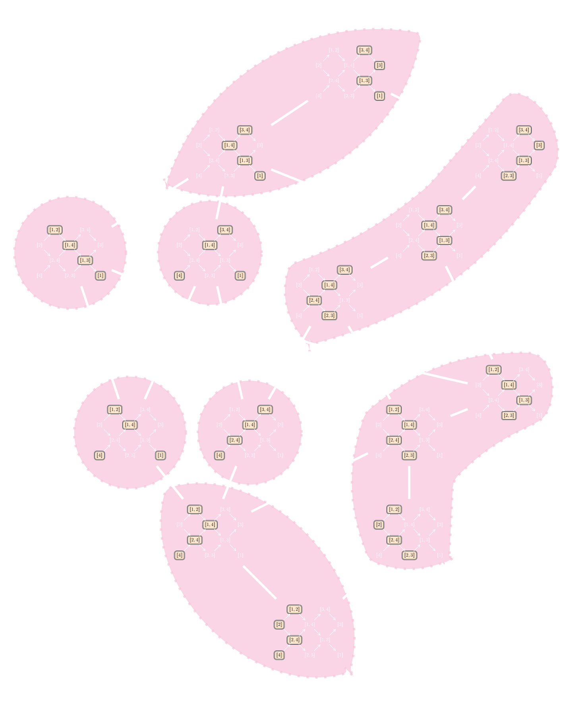
  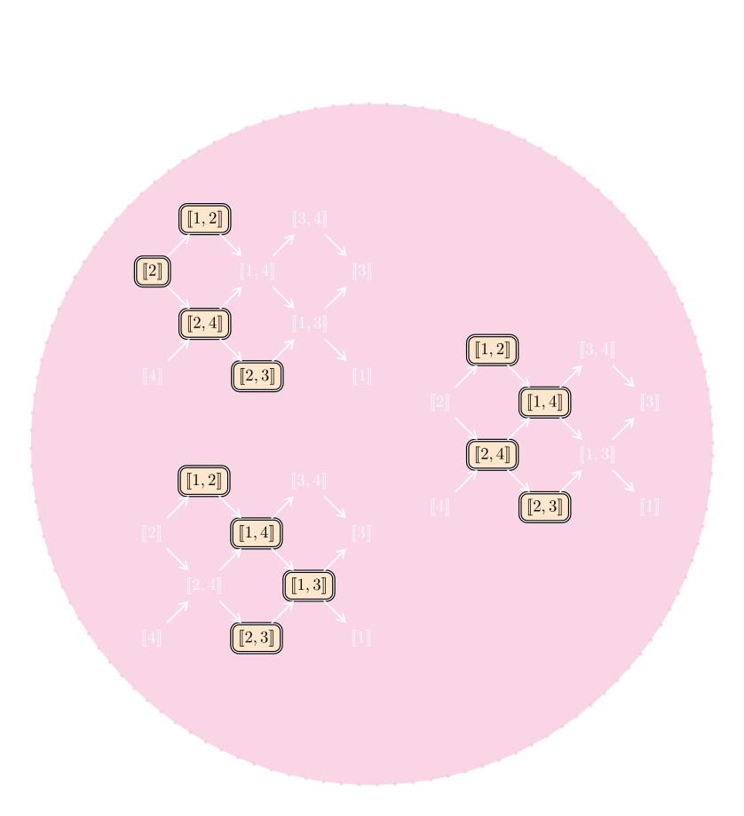
  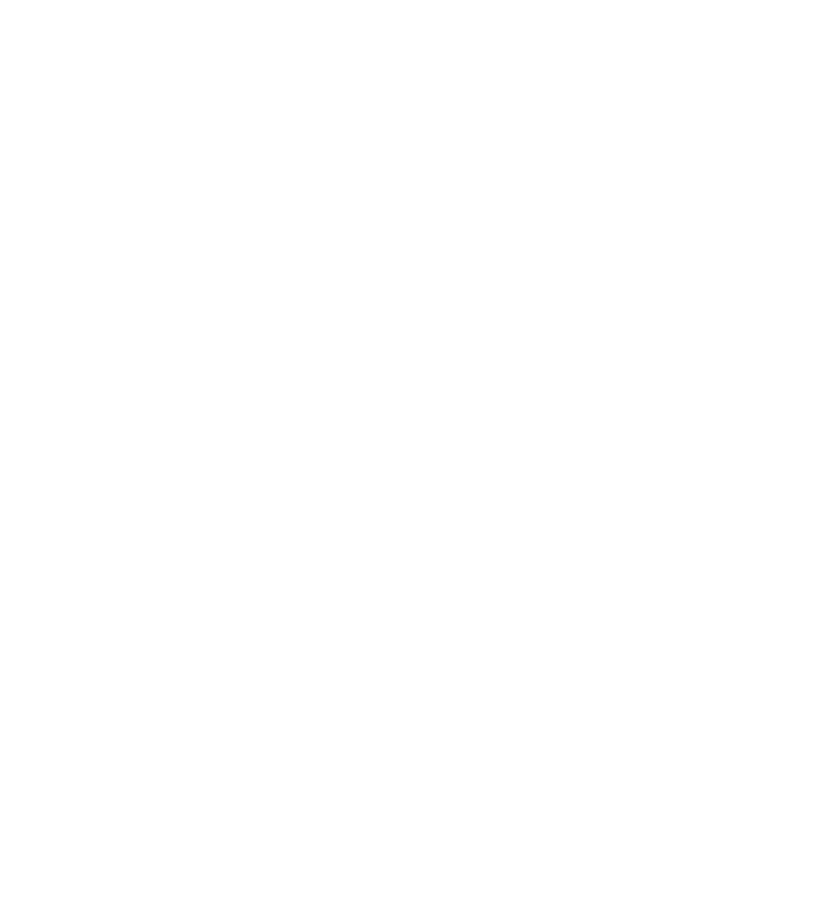
  <!-- v-click 2 : quivers travel from circle to left stack -->
  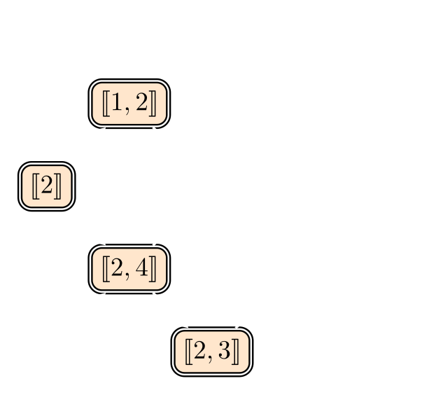
  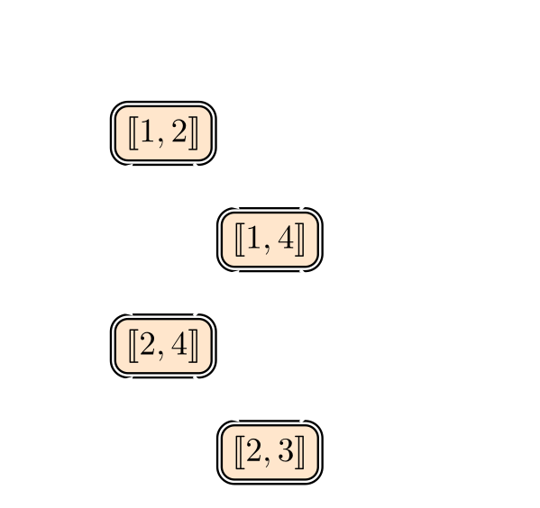
  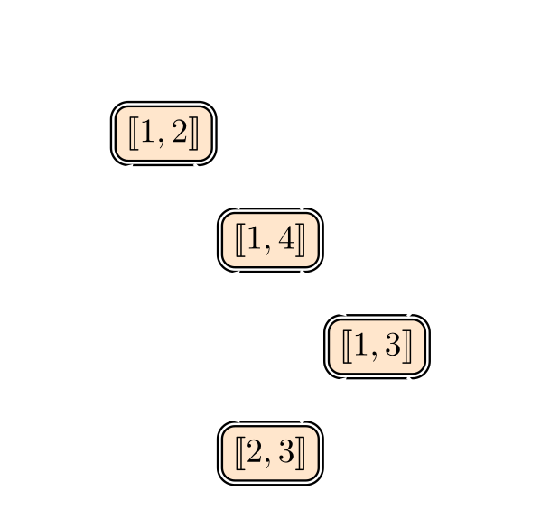
  <!-- v-click 3 : swap to highlighted versions -->
  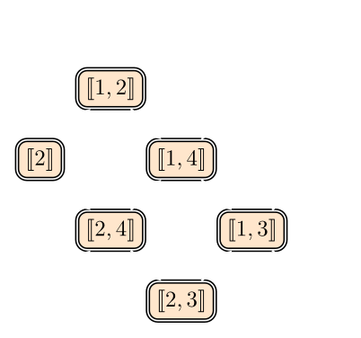
  
  
  <!-- formula fades in after highlights, no extra vclick -->
  

$\mathrm{GS}_{\mathcal{E}_\diamond}(T_1) = \mathrm{GS}_{\mathcal{E}_\diamond}(T_2) = \mathrm{GS}_{\mathcal{E}_\diamond}(T_3)$

  

---

# Deuxième théorème principal

**Théorème \[DR25\]**

Soit $T \in \operatorname{Tilt}(Q)$. Alors

$$\operatorname{GS}_{\mathcal{E}}(T) \;=\; \operatorname{add}\!\left( \bigoplus_{T' \in [T]_{\approx_{\mathcal{E}}}} T' \right).$$

**Exemple.** Supposons $Q = 1 \to 2 \leftarrow 3 \to 4$ et $\mathcal{E} = \mathcal{E}_\diamond$.

  

    
    
    
  

  

$[T_1]_{\approx_{\mathcal{E}_\diamond}}=[T_2]_{\approx_{\mathcal{E}_\diamond}}=[T_3]_{\approx_{\mathcal{E}_\diamond}}$

  

  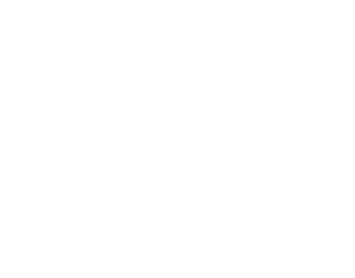

<!-- v-click 4: 4 boxes from T1 travel to plain quiver -->
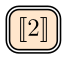
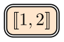
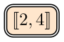
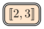
<!-- v-click 5: 4 boxes from T2 travel to plain quiver -->

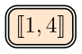

<!-- v-click 6: 4 boxes from T3 travel to plain quiver -->

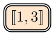

<!-- v-click 7: GS formula result -->

$\operatorname{GS}_{\mathcal{E}_\diamond}(T_1) = \operatorname{add}(T_1 \oplus T_2 \oplus T_3)$

---

# Conséquences du deuxième théorème principal

**Corollaire**

Soit $Q$ un carquois de type $A_n$.

<v-clicks>

<em>(a)</em> Il existe une bijection

$$\operatorname{Tilt}(Q) / {\approx_{\mathcal{E}_\diamond}} \;\longleftrightarrow\; \bigl\{\text{sous-catégories CJR maximales de } \operatorname{rep}(Q)\bigr\}.$$

<em>(b)</em> Soit $\mathscr{C} \subseteq \operatorname{rep}(Q)$ une sous-catégorie maximalement canoniquement retrouvable de Jordan. Alors il existe $T \in \operatorname{Tilt}(Q)$ tel que

$$\mathscr{C} = \operatorname{add}\!\left( \bigoplus_{T' \in [T]_{\approx_{\mathcal{E}_\diamond}}} T' \right).$$

</v-clicks>

---

# Synthèse et perspectives

**Une vision unifiée des structures exactes, modules MAR et retrouvabilité de Jordan**

<v-clicks>

- La **structure exacte diamant** $\mathcal{E}_\diamond$ fournit un cadre naturel reliant la théorie des modules inclinants, les modules presque rigides maximaux et la retrouvabilité de Jordan.

- Les modules MAR sont exactement les modules $\mathcal{E}_\diamond$-inclinants.

- Toute sous-catégorie maximalement canoniquement retrouvable de Jordan est de la forme $\operatorname{GS}_{\mathcal{E}_\diamond}(T)$ pour un certain objet inclinant $T$.

- Deux objets inclinants $T, T'$ vérifient $\operatorname{GS}_{\mathcal{E}}(T) = \operatorname{GS}_{\mathcal{E}}(T')$ si et seulement s'ils sont reliés par une suite de **$\mathcal{E}$-mutations**.

- Il existe une bijection
$$\operatorname{Tilt}(Q)/{\approx_{\mathcal{E}_\diamond}} \;\longleftrightarrow\; \{\text{sous-catégories CJR maximales de }\operatorname{rep}(Q)\},$$
donnée par $[T]_{\approx_{\mathcal{E}_\diamond}} \;\longmapsto\; \operatorname{add}\!\Bigl(\bigoplus_{T' \in [T]_{\approx_{\mathcal{E}_\diamond}}} T'\Bigr)$.

</v-clicks>

---
layout: section
class: text-center
---

# VI. Nouveaux résultats

\[R., 2026\]

---

# Paire de réalisation inclinante

**Définition \[R., 2026\]**

Soit $(\mathscr{A}, \mathcal{E})$ une catégorie exacte. Soient $\mathfrak{R}$ et $\mathfrak{G}$ deux familles de sous-catégories additives pleines de $\mathscr{A}$. On suppose que tout élément de $\mathfrak{R}$ est $\mathcal{E}$-rigide et que tout élément de $\mathfrak{G}$ est $\mathcal{E}$-adapté.

On dit que $(\mathfrak{R}, \mathfrak{G})$ est une **paire de réalisation inclinante** si

$$\operatorname{Tilt}(\mathscr{A}) \subseteq \bigl\{\, \mathcal{R} \cap \mathcal{G} \;\big|\; \mathcal{R} \in \mathfrak{R},\, \mathcal{G} \in \mathfrak{G} \,\bigr\}.$$

**Remarque.** On dit que $(\mathfrak{R}, \mathfrak{G})$ est une **paire de réalisation inclinante maximale** si de plus tout $\mathcal{R} \in \mathfrak{R}$ est maximalement $\mathcal{E}$-rigide et tout $\mathcal{G} \in \mathfrak{G}$ est maximalement $\mathcal{E}$-adapté.

---

# Exemples de paires de réalisation inclinante

**Proposition \[R., 2026\]**

Soit $Q$ un carquois de Dynkin et $(\operatorname{rep}(Q), \mathcal{E})$ une catégorie exacte 0-Auslander. Alors

$$\Bigl(\operatorname{Tilt}_\mathcal{E}(Q),\; \bigl\{\operatorname{GS}_\mathcal{E}(T) \mid T \in \operatorname{Tilt}(Q)\bigr\}\Bigr)$$

est une **paire de réalisation inclinante maximale**.

<v-clicks>

*Idée de la preuve.* &nbsp;Soit $T \in \operatorname{Tilt}(Q)$.

Puisque $(\operatorname{rep}(Q), \mathcal{E})$ est 0-Auslander, $\mathcal{E}$-inclinant $\Leftrightarrow$ maximal $\mathcal{E}$-rigide. On construit $T_\mathcal{E} \in \operatorname{Tilt}_\mathcal{E}(Q)$ en complétant $T$ en un objet maximal $\mathcal{E}$-rigide.

On a que $\operatorname{add}(T) \subseteq \operatorname{add}(T_\mathcal{E}) \cap \operatorname{GS}_\mathcal{E}(T)$.

D'autre part, $\operatorname{add}(T_\mathcal{E}) \cap \operatorname{GS}_\mathcal{E}(T)$ est $\mathcal{E}$-rigide et $\mathcal{E}$-adapté, donc rigide. Ainsi $\operatorname{add}(T) = \operatorname{add}(T_\mathcal{E}) \cap \operatorname{GS}_\mathcal{E}(T)$. $\square$

</v-clicks>

---

# Exemples de paires de réalisation inclinante

**Corollaire \[R., 2026\]**

Soit $Q$ un carquois de Dynkin. Les paires suivantes sont des paires de réalisation inclinante **maximales** :

<v-clicks>

(a) $\displaystyle\bigl(\operatorname{Tilt}_{\mathcal{E}_{\min}}(Q),\; \{\operatorname{GS}_{\mathcal{E}_{\min}}(T) \mid T \in \operatorname{Tilt}(Q)\}\bigr) = \bigl(\operatorname{rep}(Q),\; \operatorname{Tilt}(Q)\bigr)$

(b) $\displaystyle\bigl(\operatorname{Tilt}_{\mathcal{E}_{\max}}(Q),\; \{\operatorname{GS}_{\mathcal{E}_{\max}}(T) \mid T \in \operatorname{Tilt}(Q)\}\bigr) = \bigl(\operatorname{Tilt}(Q),\; \operatorname{rep}(Q)\bigr)$

*Dans le cas où $Q$ est de type $A_n$ :*

&#40;c&#41; $\displaystyle\bigl(\operatorname{Tilt}_{\mathcal{E}_\diamond}(Q),\; \{\operatorname{GS}_{\mathcal{E}_\diamond}(T) \mid T \in \operatorname{Tilt}(Q)\}\bigr) = \bigl(\operatorname{MAR}(Q),\; \operatorname{CJR}(Q)\bigr)$

</v-clicks>

---
layout: center
---

# Merci de votre attention !

Questions ?

  

  Sunny Roy &nbsp;·&nbsp; Université de Sherbrooke &nbsp;·&nbsp; Soutenance de thèse

